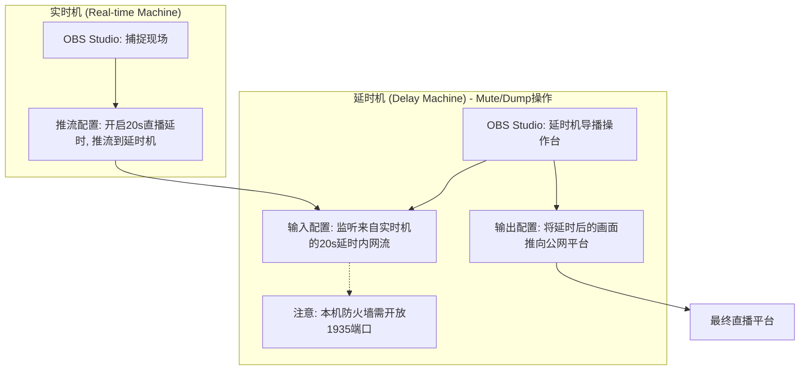

## Table of contents

## 背景：为什么国内直播必须做「安全播出」

在抖音、快手、淘宝直播等国内平台，直播间会被 AI 与人工双重审核，稍有不慎就可能触发秒封。因此，大多数机构都会预留 **20 秒以上的延时**，给后台运营同事留出 `DUMP/MUTE` 的反应时间。某大厂的电竞直播，为了规避风险，甚至有高达 2 分钟的延时。虽然这常被观众诟病「播出画面比实时对局慢太多」，但对于商业公司而言，给最后把关的人留出充足的反应时间来处理可能违规声音或画面，其重要性远超被观众吐槽画面延迟。

## 前言：一个价值 20 秒的翻车现场

没有专业的延时机，但却想在 OBS 里实现 20 秒「安全延时」，应该如何做呢？

### 初步尝试：天真地以为滤镜能搞定一切

经过一番寻找，计划是使用 OBS 自带的 `Video Delay (Async)` 滤镜，来实现

```text
滤镜 → 渲染延迟（Video Delay (Async)）
延迟：20000 ms
```


需要注意的是，OBS 的渲染延迟滤镜，只针对视频帧进行延时，音频依旧按实时时间戳发送

> 那声音应该如何处理延时呢？

### 声音这一段：我的做法

我当时的尝试流程如下：

1. 在 **混音器 → 高级音频属性** 中，把需要直播出去的各路音频源的「同步偏移 (Sync Offset)」全部填成 `20000 ms`，力求与视频帧保持同一延迟。  
2. 但我在「音频监控」里勾选 **监听并输出 (Monitor and Output)**，虽然此时监听并不会受 Sync Offset 影响依旧是实时的，但直播推流出去的确实已经延迟了 20 秒，与视频的延迟同步了。


**然而，推流到远程服务器后，直播开始没多久，直播间瞬间变成事故现场，负责监流的同事反馈间歇性出现噼里啪啦的爆音，直播画面无法使用！**

### 探寻真相：是什么导致了数字失真？

我百思不得其解，开始查阅 OBS 的 GitHub issue 和官方论坛。经过一番挖掘，真相浮出水面：

**1. 「渲染延迟」滤镜的设计初衷并非用于「安全播出」**[^1]
这个滤镜的本名是「视频异步延迟」，它的设计目标仅仅是修正 100-200 毫秒级别的口型同步误差，根本不是为长达数十秒的「安全播出」场景设计的，虽然它确实可以设置单个滤镜 20 秒级别的视频渲染延迟。

**2. OBS 音频缓冲存在 960 ms 的硬性上限**[^2]
我发现，OBS 的源代码里把音频的最大缓冲时间（`max buffering`）写死在了 `960 ms`。这意味着，无论你在滤镜里填入多大的数值，音频轨道最多只能延迟不到 1 秒。

**3. 混音器 & 音频滤镜并不能「弥补」这 20 秒空洞**  
在发现视频滞后以后，我第一反应是去 **高级音频属性 → 同步偏移 (Sync Offset)** 里硬填 `20000 ms`，并在「混音器」面板手动把麦克风通道 **推迟监听**，妄图用音频侧的「手动延时」与视频对齐。  
但结果依旧翻车，原因有两点：

- **上限仍然被 960 ms 卡死**：Sync Offset 实际调用的是同一份音频缓冲区，它同样会被内核的 `max buffering` 强制截断。  
- **混音器不会改写封包时间戳**：即便声卡监听听起来「同步」了，OBS 推向 RTMP 时仍按原始时间戳发送，服务器端依旧视为「音早画晚」，重采样/丢包操作仍然发生。

换句话说，*你在本地听到的并不等于观众听到的*——混音器的小推子和滤镜里的「同步偏移」只能满足 <1 秒的口型微调，面对 20 秒级别的安全延时毫无胜算。

当我天真地填入 `20000 ms` 时，灾难发生了：

- **视频**：真的被乖乖延迟了 20 秒。
- **音频**：由于 960ms 的限制，即使我在「高级音频属性」里设置了 20000ms 的「同步偏移量 (Sync Offset)」，该设置也会被 OBS 忽略。音频实际上仍以接近实时的时间戳被发送出去。

音视频两条轨道的时间戳，就此产生了接近 20 秒的巨大鸿沟。当这两条流被推送到 RTMP 服务器（如 YouTube、Bilibili）后，服务器为了强行将它们对齐，只能对音频数据进行剧烈的、破坏性的重采样或丢包处理——这，就是我们听到的「兹啦」爆音的根源。

为了验证我的猜想，我用自己的 YouTube 账号反复推流测试，最终确认：**一旦「渲染延迟」滤镜的数值超过 10 秒，直播观看端几乎 100% 会产生这种爆破式数字失真。**

搞清楚了问题根源，真正的解决方案也就浮出水面了。

---

## 破案了：问题出在「层」，而非「旋钮」

这次惨痛的翻车经历，让我彻底想明白了一件事：我之前对「延时」的理解，从根上就错了。

我天真地以为延时就是「把东西卡住一会儿再放出去」，所以满世界找 OBS 里那些「能拖动的旋钮」，比如滤镜和同步偏移。

事实证明，我错误地把**底层「渲染层」的调节**，当成了**高层「协议层」的缓冲**。

真正的安全延时，必须在**完整的流封装层**（如 RTMP/SRT）进行整体滞后，让音视频数据包整整齐齐地一起排队出发。任何试图在渲染层动刀子的行为，最终都会导致音画不同步，甚至爆音，从而翻车。

### 我的工程反思

这次踩坑，也让我对技术方案的设计有了更深的体会：

1. **分层思维**：UI 界面上一个小旋钮，背后可往往是完全不同的技术抽象。延时属于「传输层」的问题，如果强行在「渲染层」解决，最终只会得到一个「看似可用」的假象。
2. **端到端视角**：永远不要相信本地的耳朵和眼睛。监听端「感觉同步」不等于 CDN 服务端「逻辑同步」。诊断问题必须依赖对最终输出流的检查。

## 实战：如何搭建「乞丐版」安全播出架构

在国内做直播，嘉宾一句口误就可能让整场直播瞬间下线。电视台有几十万的专业硬件延时器，但我们小团队没有这个预算，就必须依靠**架构设计来弥补**：

- **技术实现**：利用「上游延时 + 本机监听」的方案，搭建出经济实惠的「乞丐版安全播出」系统。
- **操作流程**：将 `DUMP`（丢帧）、`MUTE`（静音）等关键操作绑定到 Stream Deck 这类设备上，为人工审核创造 5-10 秒的黄金反应窗口。

### 具体搭建方案

搞清楚了原理，我们就可以着手搭建一套真正可用的延时方案了。这套方案的核心，就是**将延时任务交给上游的「推流机」，而你的主力「播出机」只负责接收处理好的、已经带延时的音视频流。**

1. **推流机 / 延时机**
   - 在这台设备上使用 **OBS 的 Broadcast Delay**、vMix 或专业硬件延时器。
   - 缓存 20 秒的视频流，并设置好紧急情况下的 `DUMP` (快速丢帧) / `MUTE` (静音) 热键。

2. **播出机 (你的主力 OBS)**
    - 通过 **RTMP 或 SRT 协议** *监听* 上一台机器处理好的延时流。
    - **不再使用任何延迟滤镜**。
    - 像往常一样，正常推流到各大直播平台。

这个方案的妙处在于，音视频在抵达你的播出机之前就已经完美同步了，播出机也无需消耗大量内存来缓存那 20 秒的画面，从根本上杜绝了爆音的可能。

### 用 OBS 实现的极简方案：无需插件，OBS 变身推流服务器

#### 方案一：RTMP — 媒体源 + `listen=1`[^3]

这是最经典、兼容性最好的方案。

##### RTMP 接收端 (播出机 OBS)

1. 在场景中添加一个新的「**媒体源**」。
2. **取消勾选**「本地文件」。
3. 在「**输入**」框中填入：

    ```text
    rtmp://0.0.0.0:1935/live/app
    ```

4. 在「**FFmpeg 选项**」中，填入一个关键参数：

    ```text
    listen=1
    ```

    做完这一步，你的播出机就已经在 1935 端口「竖起耳朵」，等待推流机「上门」。

##### RTMP 发送端 (延时机 OBS)

1. 打开 `设置` → `推流`。
2. 服务选「**自定义**」。
3. 服务器地址填写 `rtmp://<播出机 IP>:1935/live/app`。
4. 串流密钥无需填写或随意填写。

接着在 OBS 设置-高级-直播延时，启动延迟，这里设置为 20 秒[^4]


点击「**开始推流**」，延时画面就会稳稳地出现在播出机的媒体源里。

---

#### 同理，方案二：SRT — OBS 25+ 内置，更低延迟

自 OBS 25.0 起，官方内置 SRT 协议，配置更简单；其基于 UDP 的特性在网络状况不佳时通常优于基于 TCP 的 RTMP

##### SRT 接收端 (播出机 OBS)[^5]

```text
媒体源 → 取消勾选「本地文件」
输入 = srt://0.0.0.0:6000?mode=listener
```

##### SRT 发送端 (延时机 OBS)

```text
设置 → 推流 → 自定义
服务器 = srt://<播出机 IP>:6000?mode=caller
```

在 OBS 设置-高级-直播延时，启动延迟，设置为 20 秒

同样，点击「**开始推流**」，画面即达，此时使用 SRT 协议的延时画面，会比 RTMP 的延迟更低。

图示（以双机 OBS RTMP 传输为例）



---

## 常见问答 (FAQ)

**Q: 用 OBS-NDI 插件可以实现上述效果吗？**

A: 不可以。NDI 插件只用于**实时传输**，特点就是为了低延迟，用来做局域网内延时，是本末倒置。

---

### 补充

#### 直播间高危词汇（举例）

- 「总书记」等党和国家领导人职务/姓名（幽默的是，笔者亲历过就算现场嘉宾说的是，「高举 xxx 同志思想旗帜」，这种正面宣传也可能导致直播间会被封禁）
- 各类敏感政治事件（8²事件）、口号
- 少数民族语言（如藏语）——平台语音识别模型无法及时判别，极易被误判违规

#### 直播间高危画面

- 境外人士出镜
- 未成年人出镜
- 国旗、党旗、国徽、党徽等官方标识

只要踩到以上任意一条，直播间都有被立即封禁的风险。

**安全播出（延时 + 实时监控处理问题声音画面）** 因而成为国内做商业直播的标配。

## Footnotes

[^1]: [Render Delay Filter | 渲染延迟滤镜官方说明](https://obsproject.com/kb/render-delay-filter)
[^2]: [MAX_BUFFERING_TICKS — Artificial Limit to Audio Sync Offset? | OBS 960 ms 音频缓冲上限讨论](https://obsproject.com/forum/threads/max_buffering_ticks-artificial-limit-to-audio-sync_offset.54867/)
[^3]: [OBS Forum 讨论 "help with media source and rtmp" 指出 `media source` 中设置 `listen=1` 可使 OBS 充当 RTMP 服务器](https://obsproject.com/forum/threads/help-with-media-source-and-rtmp.56959/)
[^4]: [OBS 论坛帖子 "Adding a timed delay to my stream" 说明在 Settings → Broadcast/Advanced 中可直接启用 Broadcast/Stream Delay](https://obsproject.com/forum/threads/adding-a-timed-delay-to-my-stream.2483/)
[^5]: [OBS 官方知识库《SRT Protocol Streaming Guide》阐述在 URL 中使用 `mode=listener` / `mode=caller` 等参数的写法与含义](https://obsproject.com/kb/srt-protocol-streaming-guide)
