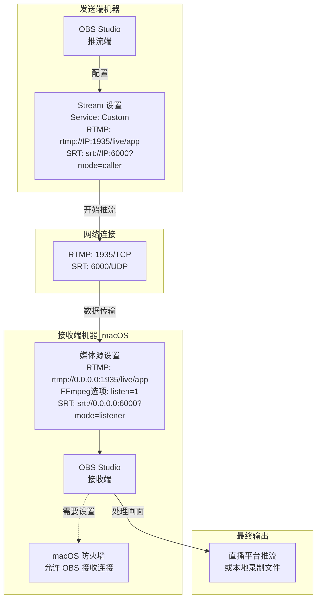

## 背景：国内直播做「安全」播出

在抖音、快手、视频号等国内平台，直播间会被 AI 与人工双重审核，稍有不慎就可能触发秒封。

因此，大多数机构都会预留 **20 秒以上的延时**，某厂的电竞直播，甚至有高达 2 分钟的延时，给最后把关的人留出 `DUMP / MUTE` 的反应时间。

### 直播间高危词汇（举例）

- 「总书记」等党和国家领导人职务 / 姓名（幽默的是，笔者亲历过就算现场嘉宾说的是，「高举 xxx 思想旗帜」，这种正面宣传也会被封禁）
- 各类敏感政治事件、口号
- 少数民族语言（如藏语）——平台语音识别模型无法及时判别，极易被误判违规

### 直播间高危画面

- 境外人士出镜
- 未成年人出镜
- 国旗、党旗、国徽、党徽等官方标识

只要踩到以上任意一条，直播间都有被立即封禁的风险。**安全播出（延时 + 实时监控）** 因而成为国内做商业直播的标配。

## 前言：一个价值 20 秒的惨案

如果你也想在 OBS 里实现专业的 20 秒「安全延时」，却被突如其来的「兹啦」爆音劝退，那么恭喜你，踩到了我曾奋力爬出的大坑。

第一次搞延时直播，我天真地以为，只需在视频源上挂一个滤镜就能高枕无忧：

```text
滤镜 → 渲染延迟（Video Delay (Async)）
延迟：20000 ms
```

然而，直播开始没多久，直播间瞬间变成事故现场，观众纷纷刷屏：

> "我的耳机炸了！" "这是什么电钻声音？" "主播快检查下音频！"

复盘日志，我才发现 OBS 正疯狂输出同一条警告：

```text
Max audio buffering reached! … total audio buffering is now 960 milliseconds.
```

真相大白：**OBS 的音频环形缓冲区上限仅为 960 毫秒**。这意味着，我的视频可以乖乖地延迟 20 秒，但音频最多只能等不到 1 秒。两条轨道严重不同步，编码器只能疯狂"追赶"进度，结果就是产生刺耳的爆破音。

---

## 破案了：延时得上游做，本机只管播

经历过这次翻车，我得出了血的教训：**真正的安全延时，应该交给「上一级设备处理，本地播出机只负责接收和推流。**

### 正确的流程应该是这样：

1.  **推流机 / 延时机**
    *   在这台设备上使用 **OBS 的 Broadcast Delay**、vMix 或专业硬件延时器。
    *   缓存 20 秒的视频流，并设置好紧急情况下的 `DUMP` (快速丢帧) / `MUTE` (静音) 热键。

2.  **播出机 (你的主力 OBS)**
    *   通过 **RTMP 或 SRT 协议** *监听* 上一台机器处理好的延时流。
    *   **不再使用任何延迟滤镜**。
    *   像往常一样，正常推流到各大直播平台。

这个方案的妙处在于，音视频在抵达你的播出机之前就已经完美同步了，播出机也无需消耗大量内存来缓存那 20 秒的画面，从根本上杜绝了爆音的可能。

---

## 极简方案：无需插件，OBS 变身推流服务器

> **核心亮点：** OBS 内置了强大的 FFmpeg，所以我们**无需安装任何第三方插件**，就能把它变成一个 RTMP 或 SRT 服务器，实现上述流程。

### 方案一：RTMP — 媒体源 + `listen=1`

这是最经典、兼容性最好的方案。

**接收端 (播出机 OBS)**

1.  在场景中添加一个新的「**媒体源**」。
2.  **取消勾选**「本地文件」。
3.  在「**输入**」框中填入：
    ```text
    rtmp://0.0.0.0:1935/live/app
    ```
4.  在「**FFmpeg 选项**」中，填入一个关键参数：
    ```text
    listen=1
    ```
    做完这一步，你的播出机就已经在 1935 端口"竖起耳朵"，等待推流机"上门"了。

**发送端 (延时机 OBS)**

1.  打开 `设置` → `推流`。
2.  服务选「**自定义**」。
3.  服务器地址填 `rtmp://<播出机IP>:1935/live/app`。
4.  串流密钥随意填写。

点击「**开始推流**」，延时画面就会稳稳地出现在播出机的媒体源里。

---

### 方案二：SRT — OBS 25+ 内置，更低延迟

从 OBS 25.0 版本开始，官方内置了 SRT 协议支持，设置更简单，且在网络状况不佳时表现通常优于 RTMP。

**接收端 (播出机 OBS)**

```text
媒体源 → 取消勾选「本地文件」
输入 = srt://0.0.0.0:6000?mode=listener&latency=200000
```
*这里的 `latency` 是用于网络抖动的缓冲，不是我们想要的 20 秒延时。*

**发送端 (延时机 OBS)**

```text
设置 → 推流 → 自定义
服务器 = srt://<播出机IP>:6000?mode=caller&latency=200000
```

同样，点击「**开始推流**」，画面即达。

## 图示



---

## 常见问答 (FAQ)

**Q: 用 OBS-NDI 插件可以实现上述效果吗？**

A: 不可以，NDI 插件只用于实时传输，特点是延迟低，但无法实现局域网内延时。

**Q: `latency` 参数应该怎么填？**

A: 这是指网络传输延迟，不是节目延时。在局域网内，`200000` 微秒 (200 毫秒) 绰绰有余；如果两台机器通过公网连接，建议至少设置为 RTT (网络往返延迟) 的 2.5 倍。

---

## 一份可落地的 SOP

1.  **延时机**：设置 20 秒的 `Broadcast Delay`，并反复测试 `DUMP` 快捷键，确认能按预期丢弃 5 秒画面。
2.  **播出机**：通过 RTMP 或 SRT 监听延时流，并在主音频通道上挂一个 `Limiter` (限制器) 插件，阈值设为 `-1 dBTP`，防止意外爆音。
3.  **开播前**：仔细检查播出机日志，确保没有 `Max audio buffering reached!` 的警告。
4.  **直播中**：双机互为备份，有条件的话，再加一路硬件编码器作为最终的"救火队员"。

---

> **"滤镜延时上限九百六，妄想一步到位必翻车；<br>上游延时下游监听，穷人智慧也能稳播出。"**
