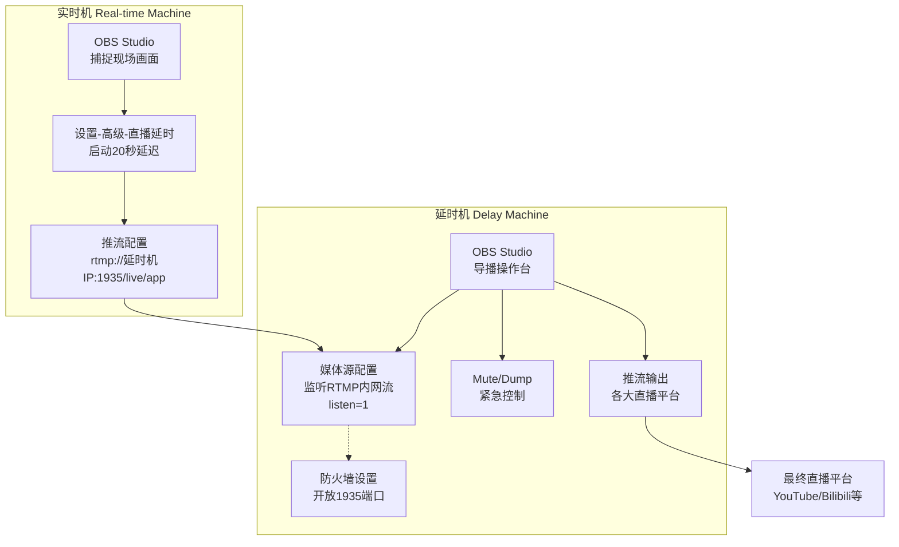

## Table of contents

- [Background: why 'safe broadcast' is required](#background-why-safe-broadcast-is-required)
- [A costly failure: the 20-second test](#a-costly-failure-the-20-second-test)
- [First attempt: assuming a filter could do it all](#first-attempt-assuming-a-filter-could-do-it-all)
- [How I tried to delay the audio](#how-i-tried-to-delay-the-audio)
- [Root cause: where the distortion comes from](#root-cause-where-the-distortion-comes-from)
- [Lesson learned: fix the layer, not the knob](#lesson-learned-fix-the-layer-not-the-knob)
- [Engineering takeaways](#engineering-takeaways)
- [A pragmatic dual-OBS 'safe broadcast' architecture](#a-pragmatic-dual-obs-safe-broadcast-architecture)
- [Concrete setup](#concrete-setup)
- [Minimal OBS-only setup: no plugins, make OBS the server](#minimal-obs-only-setup-no-plugins-make-obs-the-server)
- [Option 1: RTMP — Media Source + listen=1](#option-1-rtmp--media-source--listen1)
- [Option 2: SRT — built into OBS 25+, lower latency](#option-2-srt---built-into-obs-25-lower-latency)
- [FAQ](#faq)
- [High-risk words (examples)](#high-risk-words-examples)
- [High-risk visuals](#high-risk-visuals)
- [Footnotes](#footnotes)

## Background: why 'safe broadcast' is required

On Chinese platforms like Douyin, Kuaishou and Taobao Live, streams are reviewed by both AI and human moderators. A single slip can get a room suspended instantly. To mitigate risk, most teams keep a delay of at least **20 seconds** so operators have time to `DUMP/MUTE`. Top esports broadcasts sometimes go as high as 2 minutes. Viewers may complain about latency, but for businesses, giving the last‑mile moderator enough time to react is far more important than shaving a few seconds off the delay.

## A costly failure: the 20-second test

I didn't have a dedicated delay unit, but still wanted a 20‑second delay in OBS. How hard could it be?

### First attempt: assuming a filter could do it all

The plan was to use OBS's built‑in `Video Delay (Async)` filter:

```text
Filter → Video Delay (Async)
Delay  → 20000 ms
```


Important: the Video Delay (Async) filter delays video frames only. Audio is still sent with real‑time timestamps.

> So how should we delay the audio?

### How I tried to delay the audio

Here's what I tried:

1. In **Mixer → Advanced Audio Properties**, set the **Sync Offset** of all outbound audio sources to `20000 ms` to match the video delay.
2. In Audio Monitoring, enable **Monitor and Output** so local monitoring stays real‑time while the outbound stream is 20 seconds late (matching video).


**However, once pushed upstream, the live room soon turned into a disaster: intermittent crackling and unusable audio on the platform side.**

### Root cause: where the distortion comes from

This puzzled me, so I combed through GitHub issues and the OBS forum. Here's what I found:

**1) Video Delay (Async) is not designed for 'safe broadcast'**[^1] — its real purpose is correcting lip‑sync differences on the order of 100–200 ms. It was never designed for tens‑of‑seconds broadcast delay — even if you can type a big number in the UI.

**2) OBS audio buffering has a hard cap at ~960 ms**[^2] — in OBS's code, the maximum audio buffering (`max buffering`) is effectively limited to about `960 ms`. No matter what you type in the filter, audio won't delay beyond ~1 second.

**3) Mixers/filters can't 'fill' a 20‑second gap** — After noticing video was behind, I tried forcing `20000 ms` in **Advanced Audio Properties → Sync Offset** and delaying monitoring on the mic channel. Still failed, for two reasons:

- **The 960 ms ceiling still applies** — Sync Offset relies on the same buffer and gets clipped.
- **Mixers don't rewrite timestamps** — even if monitoring sounds "in sync", RTMP packets keep original timestamps. The server still sees "audio early, video late" and starts resampling/dropping.

In short, _what you hear locally is not what the audience hears_. Mixer sliders and 'sync offset' filters are for sub‑second lip‑sync tweaks — not 20‑second broadcast delays.

With `20000 ms` set:

- **Video** really was 20 seconds late.
- **Audio** ignored the offset due to the 960 ms cap and remained close to real time.

That ~20‑second timestamp gap forced the RTMP server (YouTube/Bilibili) to "fix" sync by aggressive resampling/dropping on the audio track — the source of the crackling.

I validated this repeatedly on YouTube: **once Video Delay exceeds ~10 seconds, crackling/distortion almost always appears for viewers.**

---

## Lesson learned: fix the layer, not the knob

My mistake was treating **render‑layer knobs** as if they were **transport‑layer buffers**. Proper broadcast delay must happen at the **stream/packaging layer** (RTMP/SRT), where audio and video packets are delayed together.

### Engineering takeaways

1. **Layering matters** — a small UI slider can hide a very different abstraction underneath. Delay belongs to the transport layer; forcing it in the render layer yields a fragile illusion.
2. **End‑to‑end view** — local monitoring "feels fine" is not the same as CDN ingest being logically in sync. Always inspect the final output stream.

## A pragmatic dual‑OBS 'safe broadcast' architecture

If you don't have a hardware delay box, architecture can still save you:

- **Technique**: keep the delay upstream and monitor locally; your broadcast box consumes an already‑delayed stream.
- **Operations**: bind `DUMP/MUTE` to a Stream Deck (or similar) to give operators a 5–10‑second reaction window.

### Concrete setup

The core idea: **the upstream delay box** handles buffering and emergency actions; **the broadcast box** just listens and forwards.

1. **Delay / upstream box**
   - Use **OBS's Broadcast Delay**, vMix, or a dedicated delay unit on this box.
   - Buffer ~20 seconds, and map hotkeys for `DUMP` (drop frames) / `MUTE` (silence) in emergencies.

2. **Main broadcast box (your primary OBS)**
   - **Listen** to the delayed stream via **RTMP or SRT**.
   - **Do not** use any delay filters here.
   - Push to platforms as usual.

This way audio and video arrive already in sync, and the broadcast box does not need to buffer 20 seconds of frames — eliminating the root cause of crackling.

### Minimal OBS‑only setup: no plugins, make OBS the server

#### Option 1: RTMP — Media Source + `listen=1`[^3]

This is the most compatible approach.

##### RTMP receiver (broadcast OBS)

1. 在场景中添加一个新的「**媒体源**」。
2. **取消勾选**「本地文件」。
3. 在「**输入**」框中填入：

   ```text
   rtmp://0.0.0.0:1935/live/app
   ```

4. 在「**FFmpeg 选项**」中，填入一个关键参数：

   ```text
   listen=1
   ```

   做完这一步，你的播出机就已经在 1935 端口「竖起耳朵」，等待推流机「上门」。

##### RTMP 发送端 (延时机 OBS)

1. 打开 `设置` → `推流`。
2. 服务选「**自定义**」。
3. 服务器地址填写 `rtmp://<播出机 IP>:1935/live/app`。
4. 串流密钥无需填写或随意填写。

接着在 OBS 设置-高级-直播延时，启动延迟，这里设置为 20 秒[^4]


点击「**开始推流**」，延时画面就会稳稳地出现在播出机的媒体源里。

---

#### Option 2: SRT — built into OBS 25+, lower latency

Since OBS 25.0, SRT is built‑in. Setup is simple, and its UDP nature usually performs better than TCP‑based RTMP on shaky networks.

##### SRT receiver (broadcast OBS)[^5]

```text
Media Source → uncheck Local File
Input = srt://0.0.0.0:6000?mode=listener
```

##### SRT sender (delay OBS)

```text
Settings → Stream → Custom
Server = srt://<broadcast-box IP>:6000?mode=caller
```

Enable **Stream Delay** in Settings → Advanced and set **20 s**.

Click **Start Streaming**; the picture arrives with lower end‑to‑end latency than RTMP.

Diagram (dual‑OBS over RTMP)



---

## FAQ

**Q: Can the OBS‑NDI plugin achieve the same effect?**

A: No. NDI is built for real‑time, low‑latency transport. Using it for long LAN delays is the wrong tool for the job.

---

### Extra notes

#### High-risk words (examples)

- Names/titles of state leaders
- Sensitive political events/slogans
- Minority languages (e.g., Tibetan) — current ASR often misclassifies and flags them

#### High-risk visuals

- Foreign nationals on camera
- Minors on camera
- National/party flags or emblems

Touching any of the above can get a live room suspended instantly. Hence **safe broadcast (delay + active monitoring for DUMP/MUTE)** is effectively mandatory for commercial streaming in China.

## Footnotes

[^1]: [Render Delay Filter | 渲染延迟滤镜官方说明](https://obsproject.com/kb/render-delay-filter)

[^2]: [MAX_BUFFERING_TICKS — Artificial Limit to Audio Sync Offset? | OBS 960 ms 音频缓冲上限讨论](https://obsproject.com/forum/threads/max_buffering_ticks-artificial-limit-to-audio-sync_offset.54867/)

[^3]: [OBS Forum 讨论 "help with media source and rtmp" 指出 `media source` 中设置 `listen=1` 可使 OBS 充当 RTMP 服务器](https://obsproject.com/forum/threads/help-with-media-source-and-rtmp.56959/)

[^4]: [OBS 论坛帖子 "Adding a timed delay to my stream" 说明在 Settings → Broadcast/Advanced 中可直接启用 Broadcast/Stream Delay](https://obsproject.com/forum/threads/adding-a-timed-delay-to-my-stream.2483/)

[^5]: [OBS 官方知识库《SRT Protocol Streaming Guide》阐述在 URL 中使用 `mode=listener` / `mode=caller` 等参数的写法与含义](https://obsproject.com/kb/srt-protocol-streaming-guide)
