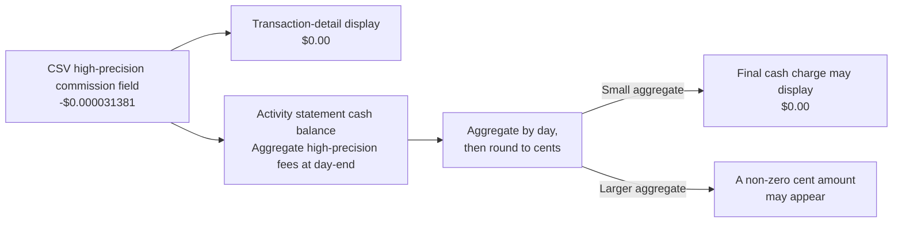

## TL;DR

**IBKR’s DRIP is not a zero-rate program, but it may result in zero actual cash charged.** The billing model and transaction details may contain a non-zero commission, while the activity statement aggregates fees by day and rounds to the currency’s smallest unit, so the final cash charge may be $0.00.

- Applicable minimum rule: under IBKR Pro Tiered or Fixed pricing, DRIP uses `min($0.35, 0.1% × Trade Value)` or `min($1, 0.1% × Trade Value)`, respectively; this is not a complete commission formula: the base commission is first calculated at the applicable per-share rate and constrained by DRIP’s special minimum rule, while the specific pricing structure may also involve third-party fees or rebates[^2]
- High-precision and day-end handling: IBKR retains high-precision fees; transaction details may show $0.00, while the cash-balance section of the activity statement aggregates fees by day and rounds to the currency’s smallest unit, so the final cash charge may be $0.00
- Example: 0.0003 share of $NVDA, trade value about $0.031284, recorded high-precision commission $0.000031381, corresponding to an actual rate of about 0.1003%, shown as $0.00
- Should you enable DRIP? For long‑term investors, yes — the advantage is automated compounding at extremely low cost, not literal zero fees
- Manual vs DRIP: pure fractional orders use the greater of $0.01 or 1% of trade value; whole-share or mixed orders use per-share pricing with a $0.35 (Tiered) or $1 (Fixed) per-order minimum, subject to a trade-value percentage cap; DRIP is usually cheaper

## A “mysterious” $NVDA dividend reinvestment

On 2025‑04‑03 I noticed my $NVDA position increased by 0.0003 share—clearly from IBKR's DRIP[^1]. The execution price was about $104.28 and the total value only $0.031. Yet the web HTML report boldly displayed the commission as **$0.00**.

**Wait a minute—isn't the minimum commission for IBKR Pro $0.35? Could it be that DRIP trades are actually fee-free?**


It looked like IBKR waived the fee, but the displayed amount needed a closer look. Exporting the detailed CSV, which exposes higher-precision data, revealed the actual numbers underneath. The raw record is long, but readers only need four numbers first:

> **How should this record be read?**
>
> - **Trade value**: `-$0.031284`
> - **High-precision commission field**: `-$0.000031381`, whose absolute value is about **0.1003%** of trade value
> - **Transaction-detail display**: `$0.00`
> - **Day’s cash balance**: may still end at `$0.00`, depending on the day-end aggregate and rounding



<details>
<summary>View the raw CSV record</summary>

```csv
Trade Data Order Stock USD NVDA 2025-04-03, 09:31:11 0.0003 104.28 101.8 -0.031284 -0.000031381 0.031315381 0 -0.0007 O;R
```

</details>

The CSV’s high-precision commission field was non-zero at $0.000031381, although the final cash charge for the day could still round to $0.00. This tiny amount still exposes how DRIP commissions really work.

## DRIP vs manual trades: different minimums

Based on IBKR docs[^2], these are the key rules. The DRIP row describes the minimum rule applicable under IBKR Pro Tiered or Fixed pricing, not a complete final-fee formula:

| Scenario                       | Commission rule                                                                                                                 | Notes                                                                                                                                                                                                | Display and cash charging                                                                               |
| ------------------------------ | ------------------------------------------------------------------------------------------------------------------------------- | ---------------------------------------------------------------------------------------------------------------------------------------------------------------------------------------------------- | ------------------------------------------------------------------------------------------------------- |
| Manual whole/mixed share order | Per-share pricing; $0.35 per-order minimum under Tiered, $1 under Fixed, subject to the applicable trade-value percentage cap   | Orders containing ≥1 whole share; a fractional portion split from a mixed order is not simply a standalone pure-fractional order                                                                     | Transaction details may round per order; cash balance is aggregated and rounded daily                   |
| Manual pure fractional order   | Per-share pricing; the greater of $0.01 or 1% of trade value                                                                    | Applies when the order is entirely fractional; do not apply it directly to a mixed order                                                                                                             | Same as above                                                                                           |
| DRIP (auto reinvest)           | Tiered: compare $0.35 with `0.1% × Trade Value`; Fixed: compare $1 with `0.1% × Trade Value`; not a complete commission formula | The base commission is first calculated at the applicable per-share rate and constrained by DRIP’s special minimum rule; the specific pricing structure may also involve third-party fees or rebates | Transaction details may show $0.00; the activity statement cash balance is aggregated and rounded daily |

With the $NVDA example:

- Trade value: ~$0.031284
- 0.1% pricing component: $0.031284 × 0.1% = $0.000031284
- Applicable DRIP minimum rule: Tiered compares `$0.000031284` with `$0.35`, while Fixed compares `$0.000031284` with `$1`; both land on the `$0.000031284` side. This is not a complete commission formula: the base commission is still calculated at the applicable per-share rate and constrained by DRIP’s special minimum rule; the specific pricing structure may also involve third-party fees or rebates.

The recorded high-precision fee was `-0.000031381`; its absolute value divided by trade value is about 0.1003%, not 1%. When shown in reports limited to two decimals, it becomes $0.00.

## How does IBKR handle commissions below one cent?

USD’s smallest display unit is a cent ($0.01). How can a broker account for fees much smaller than one cent? IBKR’s back‑office explains this[^3]:

IBKR rounds fee values shown in transaction details to the currency’s smallest unit. For USD, a positive fee smaller than half a cent will generally display as $0.00, while larger amounts are rounded to the nearest cent.

Additionally, in the cash-balance section of the activity statement, IBKR aggregates the day’s high-precision fees at day-end and rounds them to the currency’s smallest unit (what IBKR calls _fractional fee rounding_). If the day’s aggregate is below $0.005, a small DRIP’s final cash charge can indeed remain $0.00.

In other words, IBKR does not treat DRIP as zero-rate, nor does it simply carry every sub-cent fee into the next day. It retains high-precision fees, aggregates them daily in the activity statement’s cash balance, and rounds to cents. Thus, “$0.00” may be a transaction-detail display result, or it may mean that the day’s aggregate was below $0.005 and the final cash charge was $0.00. The more accurate conclusion is: a non-zero billing rule that may result in zero actual cash charged.

## So… is DRIP worth enabling?

For most long‑term investors, **yes**.

- The real win is automation and very low effective costs — not literal zero commissions.
- If you prefer manual timing, you can turn DRIP off and place your own orders. Keep in mind:
  - Pure fractional orders: per-share pricing; the greater of $0.01 or 1% of trade value[^4]
  - Orders containing whole shares: per-share pricing with a $0.35 (Tiered) or $1 (Fixed) per-order minimum, subject to the applicable trade-value percentage cap; a fractional portion split from a mixed order is not simply a standalone pure-fractional order
  - DRIP: under IBKR Pro Tiered or Fixed pricing, the trade-value component in the minimum rule is 0.1%, compared with $0.35 or $1 respectively; this is not a complete commission formula: the base commission is first calculated at the applicable per-share rate and constrained by DRIP’s special minimum rule, while the specific pricing structure may also involve third-party fees or rebates. Small amounts frequently appear as $0.00 in transaction details after rounding[^2][^5]

- Taxes still apply: dividends are subject to withholding. For a non-US tax resident, the default is generally 30%. A China tax resident who qualifies under the U.S.-China income tax treaty, is the beneficial owner of the dividends, and submits a valid W-8BEN can generally qualify for the 10% U.S. dividend withholding rate[^6][^7]. This treaty treatment should not be attributed simply to nationality or mainland identity, and DRIP does not eliminate the tax.

When you see that tempting "$0.00 commission" next time, remember that it may be a transaction-detail or activity-statement rounding result. DRIP is not a zero-rate program, but it may result in zero actual cash charged.

### FAQ: If I only have one tiny DRIP that day, will $0.01 be “charged later”?

Not necessarily. _Fractional fee rounding_ is settled daily; it does not simply carry a below-unit remainder into the next day. If the day’s aggregate is below $0.005, the final cash charge may remain $0.00. If other fee items bring the aggregate to the rounding threshold, the cash balance may show a corresponding charge of $0.01 or more.

### Erratum

The original version of this article mistakenly stated IBKR DRIP’s 0.1% rate as 1% and used an incorrect `max()` formula for ordinary orders; it also described the activity statement’s day-end aggregation and rounding mechanism inaccurately. This erratum corrects the rate, ordinary-order formula, and rounding mechanism. Both the Chinese and English versions have been updated in sync.

### footnote

<!-- markdownlint-disable MD053 -->

[^1]: Overview of Our Dividend Reinvestment Program (DRIP): https://ibkrguides.com/kb/en-us/overview-of-drip.htm

[^2]: Commissions — Stocks (fixed / tiered): https://www.interactivebrokers.com/en/index.php?f=49637

[^3]: Handling Procedures for Fractional Fees: https://www.ibkrguides.com/kb/en-us/article-1241.htm

[^4]: Fractional Share Trading — fee notes: https://www.ibkrguides.com/kb/fractional-share-trading.htm

[^5]: Dividend Election — DRIP settings and notes: https://ibkrguides.com/clientportal/dividendreinvestment.htm

[^6]: Instructions for Form W-8BEN | IRS: https://www.irs.gov/instructions/iw8ben

[^7]: United States–The People's Republic of China Income Tax Convention, Article 9 | IRS: https://www.irs.gov/pub/irs-trty/china.pdf

<!-- markdownlint-enable MD053 -->
