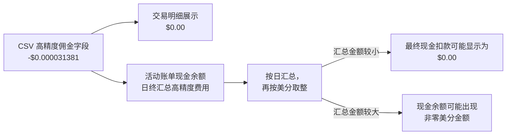

## TL;DR

**IBKR 的 DRIP 不是零费率，但可能是零实际扣款。** 计费模型和交易明细中可能存在非零佣金，而活动账单按日汇总并按货币最小单位取整后，最终现金扣款可能为 $0.00。

- **适用的最低佣金规则**：在 IBKR Pro Tiered 或 Fixed 定价下，DRIP 分别适用 `min($0.35, 0.1% × Trade Value)` 或 `min($1, 0.1% × Trade Value)`；这不是完整佣金公式，基础佣金先按适用的每股费率计算，并受 DRIP 特殊最低佣金约束，根据具体定价规则还可能涉及第三方费用或返佣[^2]
- **高精度与日终汇总**：系统保留高精度费用，交易明细可能显示为 $0.00；活动账单的现金余额部分会按日汇总后按货币最小单位取整，因此最终现金扣款可能为 $0.00
- **实际案例**：0.0003 股 $NVDA 交易，成交额约 $0.031284，记录的高精度佣金为 $0.000031381，对应实际费率约 0.1003%，显示为 $0.00
- **值得开启吗**：对长线投资者绝对值得，核心优势是自动化复利和极低费率，而非「免佣」
- **对比手动交易**：纯碎股单按 `max($0.01, 1% × Trade Value)` 取较高者；普通整股或混合订单按每股费率计算，适用 Tiered $0.35 或 Fixed $1 的每单最低佣金，同时受成交额比例上限约束；DRIP 通常更划算

## 一笔来自 $NVDA 的「神秘」股息再投资

2025 年 4 月 3 日，我突然发现，自己购买的 $NVDA，居然多了 0.0003 股，下意识反应，应该是打开了 IBKR 的 DRIP（股息再投资）[^1] 功能，
经过核实，确实是收到了一笔来自 $NVDA 的股息，并通过 DRIP 自动再投资了 0.0003 股，成交价约 $104.28，总金额仅 $0.031。
但是在 web 端导出的 HTML 交易报告中，佣金一栏赫然显示为 **$0.00**。

**此时我就心生疑惑了？不是说 IBKR Pro 最低的佣金是 $0.35 吗？难道 IBKR 自己通过 DRIP 功能进行的交易，难不成免佣金？**


看起来，IBKR 似乎慷慨地免除了这笔小额交易的佣金。但直觉告诉我事情没那么简单。

于是，经查阅 IBKR 的文档，我导出了能显示更高精度数据的 CSV 格式流水。原始记录很长，但读者真正需要先看懂的只有四个读数：

> **这笔记录该怎么读？**
>
> - **成交额**：`-$0.031284`
> - **高精度佣金字段**：`-$0.000031381`，绝对值约占成交额的 **0.1003%**
> - **交易明细展示**：`$0.00`
> - **当日现金余额**：最终可能仍为 `$0.00`，取决于日终汇总后的取整结果



<details>
<summary>查看原始 CSV 单行记录</summary>

```csv
Trade Data Order Stock USD NVDA 2025-04-03, 09:31:11 0.0003 104.28 101.8 -0.031284 -0.000031381 0.031315381 0 -0.0007 O;R
```

</details>

实际上，CSV 中的高精度佣金字段并非零，而是 0.000031381 美元；但这并不代表当天的现金余额最终一定扣除了这笔金额。

这个几乎可以忽略不计的数字，正好暴露了 IBKR DRIP 佣金的真实规则。

## DRIP vs. 手动交易：佣金规则大不同

以下是查阅 IBKR 官方文档后，总结的佣金规则[^2]。其中，DRIP 一行描述的是适用于 IBKR Pro Tiered 或 Fixed 定价的最低佣金规则，不是完整的最终费用公式：

| 场景                  | 佣金规则                                                                                               | 说明                                                                                                   | 展示与现金扣款                                          |
| --------------------- | ------------------------------------------------------------------------------------------------------ | ------------------------------------------------------------------------------------------------------ | ------------------------------------------------------- |
| **手动整股 / 混合单** | 按每股费率计算；Tiered 每单最低 \$0.35，Fixed 每单最低 \$1，同时受适用的成交额比例上限约束             | 订单里含有 ≥ 1 股整股；混合订单中被拆分执行的碎股部分，不能简单视为一笔独立的纯碎股订单                | 交易明细可能逐笔取整；现金余额按日汇总后取整            |
| **手动纯碎股单**      | 按每股费率计算，取 `max($0.01, 1% × Trade Value)` 的较高者                                             | 订单全部是小数股时适用；这条规则不能直接套用于含整股的混合订单                                         | 同上                                                    |
| **DRIP 自动再投资**   | Tiered：比较 \$0.35 与 `0.1% × Trade Value`；Fixed：比较 \$1 与 `0.1% × Trade Value`；不是完整佣金公式 | 基础佣金先按适用的每股费率计算，并受 DRIP 特殊最低佣金约束；根据具体定价规则还可能涉及第三方费用或返佣 | 交易明细可能显示 \$0.00；活动账单现金余额按日汇总后取整 |

让我们用我那笔 $NVDA 交易来实际计算一下：

- **成交金额**: ~$0.031284
- **0.1% 计费项**: $0.031284 × 0.1% = $0.000031284
- **DRIP 适用的最低佣金规则**: Tiered 比较 `$0.000031284` 和 `$0.35`，Fixed 比较 `$0.000031284` 和 `$1`；两种定价都落在 `$0.000031284` 这一侧。但这不是完整佣金公式，基础佣金仍按适用的每股费率计算，并受 DRIP 特殊最低佣金约束；根据具体定价规则，实际费用还可能涉及第三方费用或返佣。

最终记录的高精度佣金为 `-0.000031381`，其绝对值与成交额之比约为 0.1003%，而不是 1%。当这个数字呈现在只显示两位小数的交易报告中时，自然就变成了 $0.00。

## IBKR 如何处理不足一美分的佣金？

你可能会好奇，美元的最小单位应该是 1 美分（$0.01），IBKR 是如何处理这些厘甚至毫厘级别的费用的？

答案在于 IBKR 的高精度记账和日终取整机制。根据 IBKR 官方文档[^3]的说法：

IBKR 会将交易明细中的费用按该货币的最小单位取整展示。以美元为例，不足半美分量级的正向费用通常显示为 $0.00；更大的金额则按正常的美分精度取整。

此外，IBKR 还会在活动账单的现金余额部分，于**日终**把当天的高精度费用重新汇总，再按货币最小单位进行取整（官方文档称之为 _fractional fee rounding_）。因此，若当天汇总后不足 $0.005，小额 DRIP 的最终现金实际扣款确实可能是 $0.00。

> 换句话说：IBKR 不是零费率，也不是简单地把每笔厘级费用都留到次日；它会保留高精度费用，并在活动账单现金余额中按日汇总后按美分取整。因此，「$0.00」可能只是交易明细的展示结果，也可能是当日汇总不足 $0.005、最终现金实际扣款为 $0.00。更准确的核心结论是：非零计费规则，可能零实际扣款。

## 总结：DRIP 值得开启吗？

搞清楚了 DRIP 的佣金真相后，我们来回答最关键的问题：这个功能还值得开启吗？

我的建议是：**对于大多数长线投资者来说，绝对值得。**

- **真正的优势**：DRIP 的核心优势并非「免佣」，而是**自动化**和**低费率**。它能让你以极低的成本，持续不断地将股息复利投入，聚沙成塔。
- **适合懒人策略**：如果你不想为每笔小额股息手动计算买入时机，DRIP 是实现「自动复利」的最佳工具。
- **手动 vs. 自动**：如果你想自己把握买入价位，可以关闭 DRIP，攒够资金手动下单。需要注意：
  - **纯碎股单**：按每股费率计算，取 `max($0.01, 1% × Trade Value)` 的较高者[^4]；
  - **含整股单**：按每股费率计算，适用 \$0.35（Tiered）或 \$1（Fixed）的每单最低佣金，同时受适用的成交额比例上限约束；混合订单中被拆分执行的碎股部分，不能简单视为一笔独立的纯碎股订单；
  - **DRIP**：在 IBKR Pro Tiered 或 Fixed 定价下，最低佣金规则中的成交额比例为 0.1%，分别与 \$0.35 或 \$1 比较；这不是完整佣金公式，基础佣金先按适用的每股费率计算，并受 DRIP 特殊最低佣金约束，根据具体定价规则还可能涉及第三方费用或返佣，金额小到常被交易明细四舍五入显示为 \$0.00[^2][^5]。

- **税收无法避免**：无论哪种方式，股息都需要缴纳预扣税（Withholding Tax）。若你是非美国纳税居民，分红通常先按 30 % 默认预提；符合《中美所得税协定》条件的中国税收居民，在属于股息受益所有人并提交有效 W-8BEN 的情况下，通常可以适用 10% 的美国股息预扣税率[^6][^7]，但这项协定待遇不能简单归因于国籍或「中国大陆身份」，也无法通过 DRIP 免除。

所以，下次再次看到 IBKR 报表中那诱人的「$0.00 佣金」时，不妨记住：它可能是交易明细或活动账单的取整结果。DRIP 不是零费率，但可能是零实际扣款。

### 补充：当天只有这一笔 DRIP，会不会被补扣 1 美分？

> 不一定。_fractional fee rounding_ 会按日结清，不会把不足取整单位的余额简单留到次日；当天汇总后不足 $0.005 时，最终现金实际扣款可能仍为 $0.00。若当天其他费用项目使汇总达到取整门槛，则现金余额可能出现相应的 $0.01 或更多扣款。

### 勘误说明

本文原版误将 IBKR DRIP 的 0.1% 写成了 1%，并错误使用了普通订单佣金的 `max()` 公式；同时对活动账单的日终汇总与四舍五入机制表述不准确。本次勘误修正了上述费率、普通订单公式和四舍五入机制，中英文版也已同步更新。

### footnote

<!-- markdownlint-disable MD053 -->

[^1]: [Overview of Our Dividend Reinvestment Program (DRIP)| 股息再投资计划（DRIP）简介](https://ibkrguides.com/kb/en-us/overview-of-drip.htm)

[^2]: [Commissions Stocks | 美股佣金表（固定 / 阶梯）](https://www.interactivebrokers.com/en/index.php?f=49637)

[^3]: [Handling Procedures for Fractional Fees| 小数金额手续费的处理流程](https://www.ibkrguides.com/kb/en-us/article-1241.htm)

[^4]: [Fractional Share Trading | 碎股交易计费说明](https://www.ibkrguides.com/kb/fractional-share-trading.htm)

[^5]: [Dividend Election | Client Portal DRIP 设置与佣金说明](https://ibkrguides.com/clientportal/dividendreinvestment.htm)

[^6]: [Instructions for Form W-8BEN | IRS](https://www.irs.gov/instructions/iw8ben)

[^7]: [United States–The People's Republic of China Income Tax Convention, Article 9 | IRS](https://www.irs.gov/pub/irs-trty/china.pdf)

<!-- markdownlint-enable MD053 -->
