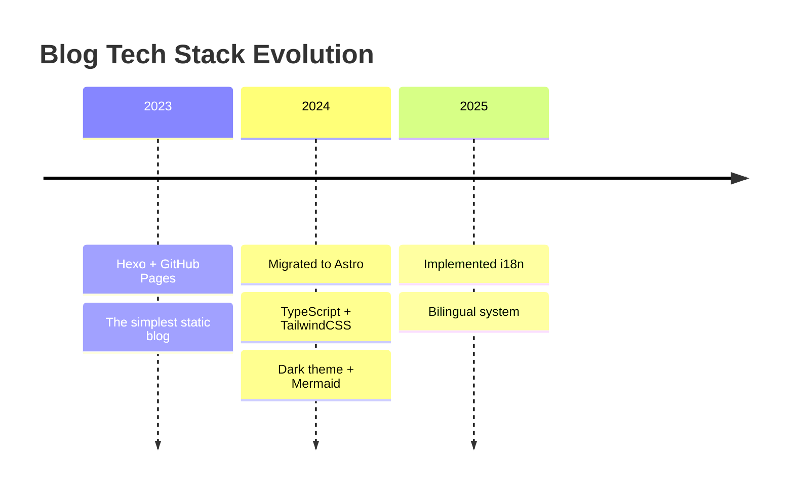

# 🚀 Blog Evolution

This blog is like my tech notebook, documenting my tinkering journey at different stages. Every refactor is a learning experience, every feature hides lessons from mistakes.

---

## 📊 Evolution Timeline

---

## 📝 Tinkering Log

### 🌱 **2023 & Earlier - The Beginning**

When I first started blogging, I chose the simplest option: Hexo. Configure `_config.yml`, drop some Markdown files into `source/_posts/`, and `hexo g && hexo d` - done. Basic but sufficient, focusing on content was the priority.

GitHub Pages offered free hosting. Sure, it was slow in China, but it was beginner-friendly.

### 🚀 **Early 2024 - Bold Refactor**

After using Hexo for over a year, I started feeling constrained. Adding features meant digging through documentation for plugins, customizing styles meant wrestling with EJS templates. Astro was gaining traction, and I liked its component-based approach and performance, so I decided to give it a shot.

The migration went smoother than expected:

- Articles were all Markdown, just copy them over
- Found AstroPaper theme - clean and minimal, exactly what I wanted
- Vercel deployment was simpler than GitHub Actions, plus it came with CDN

Upgraded the tech stack while I was at it:

- **TypeScript**: Finally got autocomplete, no more guessing APIs
- **TailwindCSS**: Atomic classes are genuinely nice, styling got much faster
- **Pagefind**: Client-side search, no backend needed, blazing fast

### 🎨 **Mid-2024 - Polishing Details**

With the basic framework in place, I started adding features I wanted:

- **Dark mode**: Essential for night owls, and the transition is smooth
- **OG image generation**: Pretty preview cards when sharing on social media - OCD satisfied
- **Mermaid support**: Drawing flowcharts in technical articles is too common
- **RSS feed**: Old-school but practical, for readers who truly care

This period was mainly about tweaking details to make the blog more comfortable to use.

### 🌏 **October 2025 - Going International**

After a year of writing, I realized some technical content was worth sharing in English to reach a wider audience. But maintaining two separate blogs was too exhausting, so I committed to implementing i18n.

This was a significant change:

- **Routing system refactor**: Chinese at `/blog/`, English at `/en/blog/`, completely separated at the code level
- **Language switcher**: Not just simple redirects, but recognizing corresponding translated articles
- **Content organization**: Establishing relationships between Chinese and English articles on the same topic
- **SEO optimization**: `hreflang` tags, separated sitemaps - did everything that needed doing

The biggest takeaway was understanding that i18n isn't just translating text - routing, navigation, search, and SEO all need consideration.

---

## 🎯 What It Looks Like Now

After all this tinkering, here's what the blog has become:

### Content Side

- 📖 Bilingual writing in Chinese and English, use whichever language you want
- 🔍 Full-text search with instant response, works offline too
- 🎨 Auto-switching dark theme to protect your eyes at night

### Technical Side

- ⚡ Lighthouse scores are basically perfect, nothing to complain about performance-wise
- 📱 Looks just as good on mobile as on desktop
- 🔒 GDPR compliant with all necessary privacy protections

### Experience Side

- 🚀 CDN acceleration, fast access globally
- 💾 Static generation, zero server load
- 🎯 No ads, no tracking, pure reading experience

---

## 💡 Some Reflections

### Why Astro?

Initially, I was attracted by "zero JS runtime." Later, I discovered what's really great:

- **Component-based development**: Extract a component whenever you want to reuse something, way more flexible than Hexo templates
- **Content collections**: TypeScript type-safe content management, more reliable than manual categorization
- **Ecosystem**: Integrating various tools is convenient, no need to reinvent wheels

### About Internationalization

A bilingual blog definitely adds workload, but it also brings new perspectives. Writing technical articles in Chinese allows more nuanced expression, while English writing emphasizes logical structure. Switching between languages subtly shifts thinking patterns.

### What's Next?

Functionality is sufficient now, not planning any major changes. Next focus will be on:

- Writing more high-quality content
- Optimizing reading experience details
- Maybe add a comment system, but still hesitating

Technology serves content - there's a point where you should stop tinkering.

---

## 🙏 Acknowledgments

Standing on the shoulders of giants:

- **[Astro](https://astro.build/)**: The framework that made me fall in love with blogging again
- **[AstroPaper](https://github.com/satnaing/astro-paper)**: Sat Naing's theme saved me countless hours
- **[TailwindCSS](https://tailwindcss.com/)**: Classes can get long, but it really works
- **[Pagefind](https://pagefind.app/)**: CloudCannon team's work, the best static search solution

And all open source contributors - you make independent blogging meaningful.

---

_This blog will keep going, documenting every stage of technical growth._ ✨
