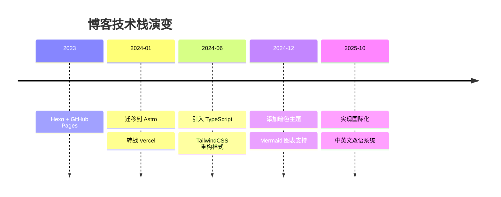

layout: ../layouts/AboutLayout.astro
title: "博客里程碑"
description: "折腾博客这些年的心路历程，经过这些折腾，博客现在长这样：

### 内容层面

## 🕰️ 演进时间线

### 体验层面

# 🚀 博客进化史

这个博客就像我的技术笔记本，记录着我在不同阶段的折腾轨迹。每次重构都是一次学习，每个功能都藏着踩过的坑。

## 🕰️ 演进时间线

## 📝 折腾日志

### 🌱 **2023年及之前 - 起点**

那时候刚开始写博客，选了最简单的 Hexo。配置 `_config.yml`，丢几个 Markdown 文件进 `source/_posts/`，`hexo g && hexo d` 一把梭。功能简陋但够用，专注写内容就好。

GitHub Pages 免费托管，虽然国内访问慢点，但对新手友好。

### 🚀 **2024年初 - 大胆重构**

用了一年多 Hexo，开始感觉不够灵活。想加个功能要翻半天文档找插件，想改个样式要跟 EJS 模板死磕。正好那时候 Astro 挺火的，看中了它的组件化和性能，决定试试水。

迁移过程比想象中顺利：

顺手把技术栈也升级了：

### 🎨 **2024年中 - 细节打磨**

基础框架搭好后，开始加各种想要的功能：

这段时间主要是不断调整细节，让博客用起来更舒服。

### 🌏 **2025年10月 - 走向国际化**

写了一年多发现，有些技术内容其实值得用英文分享给更多人。但手动维护两个博客太累，于是下决心做了国际化改造。

这次改动挺大的：

最大的收获是理解了 i18n 不只是翻译文字，路由、导航、搜索、SEO 都要考虑。

## 🎯 现在的样子

经过这些折腾，博客现在长这样：

**内容层面**

**技术层面**

**体验层面**

## 💡 一些思考

### 为什么选 Astro？

一开始是被"零 JS 运行时"吸引的。后来发现真正好用的是：

### 关于国际化

双语博客确实增加了工作量，但也带来了新视角。用中文写技术文章能表达得更细腻，用英文写更注重逻辑性。两种语言切换着写，思维方式也在潜移默化地变化。

### 下一步？

功能已经够用了，不打算再大改。接下来重点放在：

技术是为内容服务的，折腾到一定程度就该收手了。

## 🙏 感谢

站在巨人的肩膀上：

还有所有开源贡献者，你们让独立博客依然有意义。

*这个博客会一直写下去，记录技术成长的每个阶段。* ✨
