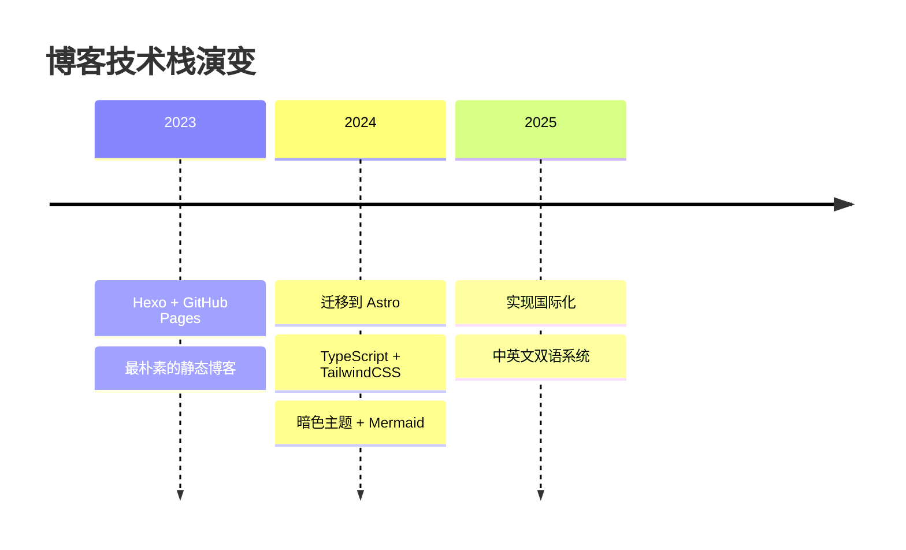

# 🚀 博客进化史

这个博客就像我的技术笔记本，记录着我在不同阶段的折腾轨迹。每次重构都是一次学习，每个功能都藏着踩过的坑。

---

## 🕰️ 演进时间线

---

## 📝 折腾日志

### 🌱 **2023年及之前 - 起点**

那时候刚开始写博客，选了最简单的 Hexo。配置 `_config.yml`，丢几个 Markdown 文件进 `source/_posts/`，`hexo g && hexo d` 一把梭。功能简陋但够用，专注写内容就好。

GitHub Pages 免费托管，虽然国内访问慢点，但对新手友好。

### 🚀 **2024年初 - 大胆重构**

用了一年多 Hexo，开始感觉不够灵活。想加个功能要翻半天文档找插件，想改个样式要跟 EJS 模板死磕。正好那时候 Astro 挺火的，看中了它的组件化和性能，决定试试水。

迁移过程比想象中顺利：

- 文章都是 Markdown，直接复制过来
- 找到 AstroPaper 主题 - 简洁干净，正是我想要的
- Vercel 部署比 GitHub Actions 简单，还自带 CDN

顺手把技术栈也升级了：

- **TypeScript**：终于有自动补全，不用再猜 API
- **TailwindCSS**：原子类确实不错，样式效率高了很多
- **Pagefind**：客户端搜索，不需要后端，速度飞快

### 🎨 **2024年中 - 细节打磨**

基础框架搭好后，开始加各种想要的功能：

- **暗色主题**：夜猫子必备，过渡还很流畅
- **OG 图片生成**：社交媒体分享时的漂亮预览卡 - 强迫症福音
- **Mermaid 支持**：技术文章画流程图太常用了
- **RSS 订阅**：老土但实用，给真正关心的读者

这段时间主要是不断调整细节，让博客用起来更舒服。

### 🌏 **2025年10月 - 走向国际化**

写了一年多发现，有些技术内容其实值得用英文分享给更多人。但手动维护两个博客太累，于是下决心做了国际化改造。

这次改动挺大的：

- **路由系统重构**：中文 `/blog/`，英文 `/en/blog/`，代码层面完全分离
- **语言切换器**：不是简单重定向，而是识别对应翻译文章
- **内容组织**：建立中英文同一主题文章的关联
- **SEO 优化**：`hreflang` 标签、分离的站点地图 - 该做的都做了

最大的收获是理解了 i18n 不只是翻译文字，路由、导航、搜索、SEO 都要考虑。

---

## 🎯 现在的样子

经过这些折腾，博客现在长这样：

### 内容层面

- 📖 中英文双语写作，你想看哪个语言就看哪个
- 🔍 全文搜索，即时响应，离线也能用
- 🎨 自动切换暗色主题，晚上保护眼睛

### 技术层面

- ⚡ Lighthouse 分数基本完美，性能没得说
- 📱 移动端和桌面端一样好看
- 🔒 GDPR 合规，该有的隐私保护都有

### 体验层面

- 🚀 CDN 加速，全球访问都很快
- 💾 静态生成，零服务器负载
- 🎯 无广告、无追踪，纯阅读体验

---

## 💡 一些思考

### 为什么选 Astro？

一开始是被"零 JS 运行时"吸引的。后来发现真正好用的是：

- **组件化开发**：想复用就抽组件，比 Hexo 模板灵活多了
- **内容集合**：TypeScript 类型安全的内容管理，比手动分类可靠
- **生态系统**：集成各种工具都很方便，不用重复造轮子

### 关于国际化

双语博客确实增加了工作量，但也带来了新视角。用中文写技术文章能表达得更细腻，用英文写更注重逻辑性。两种语言切换着写，思维方式也在潜移默化地变化。

### 下一步？

功能已经够用了，不打算再大改。接下来重点放在：

- 写更多高质量内容
- 优化阅读体验细节
- 可能加评论系统，还在犹豫

技术是为内容服务的，折腾到一定程度就该收手了。

---

## 🙏 感谢

站在巨人的肩膀上：

- **[Astro](https://astro.build/)**：让我重新爱上写博客的框架
- **[AstroPaper](https://github.com/satnaing/astro-paper)**：Sat Naing 的主题省了我无数时间
- **[TailwindCSS](https://tailwindcss.com/)**：类名确实长，但真的好用
- **[Pagefind](https://pagefind.app/)**：CloudCannon 团队的工作，最好的静态搜索方案

还有所有开源贡献者，你们让独立博客依然有意义。

---

_这个博客会一直写下去，记录技术成长的每个阶段。_ ✨
